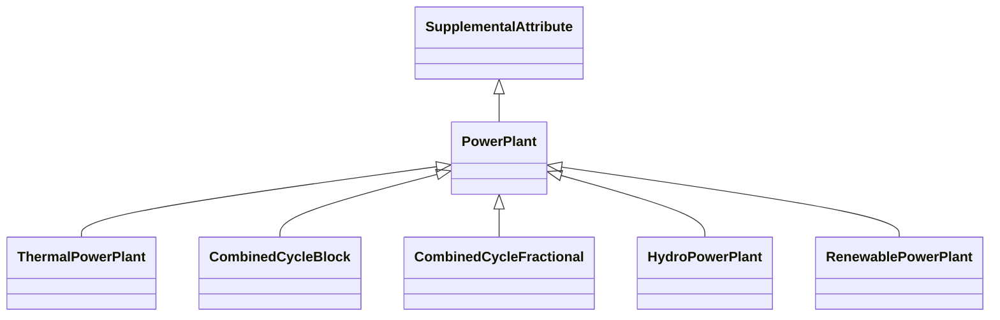

# [Grouping generators into plants](@id grouping_generators_into_plants)

## The unit vs. plant aggregation problem

In power systems modeling, there is a fundamental tension between different levels of
aggregation. Real-world power plants often consist of multiple generating units that share
physical infrastructure, but data sources and modeling requirements vary in how they
represent this relationship:

  - **Unit-level data**: Individual generators with their own capacity, cost curves, and operational constraints
  - **Plant-level data**: Aggregated capacity and characteristics representing an entire facility

For interoperable analysis across different tools and datasets, it is often necessary to track
**both** the plant and the individual units within it. This is particularly important when:

 1. **Data integration**: Combining datasets that use different aggregation levels
 2. **Shared infrastructure constraints**: Units on the same shaft, penstock, or point of common coupling
    have operational dependencies that must be modeled together
 3. **Market operations**: ISOs may require unit-level bidding while planning studies use plant-level data
 4. **Regulatory reporting**: Different reports require different aggregation levels

`PowerSystems.jl` addresses this challenge through plant supplemental attributes — [`SupplementalAttribute`](@ref)
types that group individual generator components into logical plant structures while
preserving the detailed unit-level information.

## Plant attribute types by technology

`PowerSystems.jl` provides five plant attribute types, each designed for a specific
generation technology. The [Type Tree](@ref "Type Tree") shows how they relate under the
[`PowerPlant`](@ref) abstract type.



### Thermal power plants

[`ThermalPowerPlant`](@ref) represents conventional thermal power plants with synchronous
generators. Multiple units can share a common **shaft**, which is relevant for modeling
mechanical coupling constraints.

### Combined cycle blocks

[`CombinedCycleBlock`](@ref) represents combined cycle plants using a block configuration.
Models the relationship between
combustion turbines (CTs) and steam turbines through the Heat Recovery Steam Generator (HRSG).
Combined cycle plants are typically described using a "CTs x STs" notation (e.g., 2x1 means
two combustion turbines feeding one steam turbine through an HRSG). EIA [`PrimeMovers`](@ref)
codes use `CT` and `CA` to distinguish the combustion turbine units from the steam portion
of the combined cycle.

```@raw html
<figure>

<figcaption>Combined cycle power plant configurations. Source: <a href="https://www.eia.gov/todayinenergy/detail.php?id=52158">U.S. Energy Information Administration</a></figcaption>
</figure>
```

For more information on combined cycle configurations, see the
[U.S. Energy Information Administration article on combined-cycle plants](https://www.eia.gov/todayinenergy/detail.php?id=52158).

### Combined cycle fractional plants

[`CombinedCycleFractional`](@ref) represents combined cycle generation when each unit
represents a specific operating configuration. Unlike [`CombinedCycleBlock`](@ref), which
models the CT/CA relationship
through the HRSG, the fractional representation uses **operation exclusion groups** to
define which units can operate simultaneously. Only generators with the `CC` [`PrimeMovers`](@ref)
type can be added. Heat rates and cost curves remain on the individual generator structs;
the plant attribute captures which configurations are mutually exclusive.

### Hydro power plants

[`HydroPowerPlant`](@ref) represents hydroelectric plants where multiple turbines may share
a common **penstock**
(the pipe that delivers water to the turbines). Shared penstocks create operational
dependencies between units.

### Renewable power plants

[`RenewablePowerPlant`](@ref) represents renewable energy plants (wind farms, solar farms)
where multiple generators or storage devices connect through a common **Point of Common
Coupling (PCC)** to the grid.

## Choosing a representation

| Situation                                                       | Typical choice                    |
|:--------------------------------------------------------------- |:--------------------------------- |
| Multiple thermal units on shared shafts                         | [`ThermalPowerPlant`](@ref)       |
| Combined cycle with explicit CT → HRSG → CA topology            | [`CombinedCycleBlock`](@ref)      |
| Combined cycle with mutually exclusive operating modes per unit | [`CombinedCycleFractional`](@ref) |
| Multiple hydro turbines on a shared penstock                    | [`HydroPowerPlant`](@ref)         |
| Wind or solar farm with shared grid connection                  | [`RenewablePowerPlant`](@ref)     |

Field definitions, supported component types, and accessor functions are documented in the
[Public API Reference](@ref) under Supplemental Attributes.

## See also

  - [Supplemental attributes](@ref supplemental_attributes_explanation) — the general concept
  - [Group generators into plants](@ref group_generators_into_plants) — step-by-step attachment
  - [Grouping units and emissions](@ref "Grouping Units and Emissions") — hands-on tutorial
