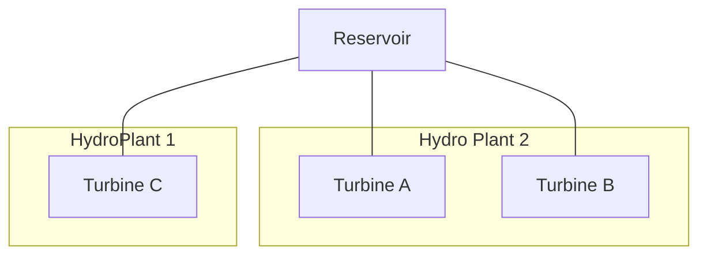
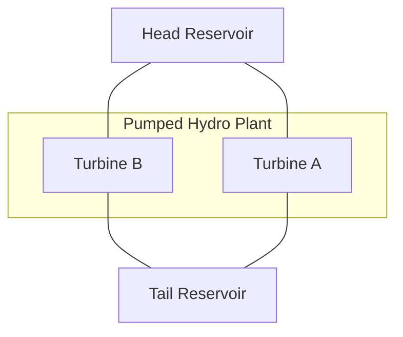

# [Hydro reservoir topology](@id hydro_reservoir_topology)

`PowerSystems.jl` supports hydropower plants where [`HydroReservoir`](@ref) components link to
[`HydroTurbine`](@ref) or [`HydroPumpTurbine`](@ref) units through explicit component
relationships. Elevations on the reservoir and turbine structs support head calculations for
downstream simulation packages.

This is separate from [**penstock grouping**](@ref grouping_generators_into_plants), which
uses the [`HydroPowerPlant`](@ref) supplemental attribute to model shared penstocks between
units. Reservoir topology describes *where water comes from*; penstock grouping describes
*which units share the same intake pipe* for supplemental plant-level constraints.

## Shared upstream reservoir

For this pattern, attach one upstream [`HydroReservoir`](@ref) to any number of
[`HydroTurbine`](@ref)s. Different powerhouse elevations on each turbine let you model
pressure-head effects across units at the same facility.

## Head and tail reservoirs for pumped storage

For pumped hydropower, attach two [`HydroReservoir`](@ref)s to [`HydroPumpTurbine`](@ref)s:
a head (upper) reservoir feeds the unit, and a tail (lower) reservoir receives outflow.

## See also

  - [Link hydro reservoirs to turbines](@ref hydro_resv) — step-by-step attachment
  - [Grouping generators into plants](@ref grouping_generators_into_plants) — penstock grouping via [`HydroPowerPlant`](@ref)
  - [Group generators into plants](@ref group_generators_into_plants) — attach penstock groupings
  - [`HydroReservoir`](@ref) — API reference (Model Library)
