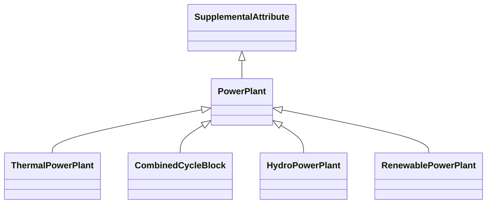

# [Plant Attributes](@id plant_attributes)

## The Unit vs. Plant Aggregation Problem

In power systems modeling, there is a fundamental tension between different levels of aggregation.
Real-world power plants often consist of multiple generating units that share physical infrastructure,
but data sources and modeling requirements vary in how they represent this relationship:

  - **Unit-level data**: Individual generators with their own capacity, cost curves, and operational constraints
  - **Plant-level data**: Aggregated capacity and characteristics representing an entire facility

For interoperable analysis across different tools and datasets, it is often necessary to track
**both** the plant and the individual units within it. This is particularly important when:

 1. **Data integration**: Combining datasets that use different aggregation levels
 2. **Shared infrastructure constraints**: Units on the same shaft, penstock, or point of common coupling
    have operational dependencies that must be modeled together
 3. **Market operations**: ISOs may require unit-level bidding while planning studies use plant-level data
 4. **Regulatory reporting**: Different reports require different aggregation levels

PowerSystems.jl addresses this challenge through **Plant Attributes**, which are
[`SupplementalAttribute`](@ref supplemental_attributes) types that group individual generator
components into logical plant structures while preserving the detailed unit-level information.

## Plant Attribute Types

PowerSystems.jl provides four specialized plant attribute types, each designed for a specific
generation technology:



### ThermalPowerPlant

Represents conventional thermal power plants with synchronous generators. Multiple units can
share a common **shaft**, which is relevant for modeling mechanical coupling constraints.

| Field               | Type                      | Description                                    |
|:------------------- |:------------------------- |:---------------------------------------------- |
| `name`              | `String`                  | Name of the power plant                        |
| `shaft_map`         | `Dict{Int, Vector{UUID}}` | Mapping of shaft numbers to unit UUIDs         |
| `reverse_shaft_map` | `Dict{UUID, Int}`         | Reverse mapping from unit UUID to shaft number |

### CombinedCycleBlock

Represents combined cycle plants using a block configuration. Models the relationship between
combustion turbines (CTs) and steam turbines through the Heat Recovery Steam Generator (HRSG).

| Field                           | Type                         | Description                                  |
|:------------------------------- |:---------------------------- |:-------------------------------------------- |
| `name`                          | `String`                     | Name of the combined cycle block             |
| `configuration`                 | `CombinedCycleConfiguration` | Configuration type (see below)               |
| `heat_recovery_to_steam_factor` | `Float64`                    | Factor for heat recovery to steam conversion |
| `hrsg_ct_map`                   | `Dict{Int, Vector{UUID}}`    | HRSG to CT unit mappings (inputs)            |
| `hrsg_ca_map`                   | `Dict{Int, Vector{UUID}}`    | HRSG to CA unit mappings (outputs)           |
| `ct_hrsg_map`                   | `Dict{UUID, Vector{Int}}`    | Reverse CT to HRSG mapping                   |
| `ca_hrsg_map`                   | `Dict{UUID, Vector{Int}}`    | Reverse CA to HRSG mapping                   |

The `CombinedCycleConfiguration` enum describes the plant layout. Combined cycle plants are
typically described using a "CTs x STs" notation (e.g., 2x1 means two combustion turbines
feeding one steam turbine through a Heat Recovery Steam Generator). However, the EIA
[prime mover codes](@ref pm_list) employ CT and CA to distinguish between the combustion
turbine units and the steam portion of the combined cycle respectively.

```@raw html
<figure>

<figcaption>Combined cycle power plant configurations. Source: <a href="https://www.eia.gov/todayinenergy/detail.php?id=52158">U.S. Energy Information Administration</a></figcaption>
</figure>
```

| Value                          | Configuration      | Description                              |
|:------------------------------ |:------------------ |:---------------------------------------- |
| `SingleShaftCombustionSteam`   | 1x1 (single shaft) | Single CT + single ST on one shaft       |
| `SeparateShaftCombustionSteam` | 1x1 (multi-shaft)  | Single CT + single ST on separate shafts |
| `DoubleCombustionOneSteam`     | 2x1                | Two CTs feeding one ST via HRSG          |
| `TripleCombustionOneSteam`     | 3x1                | Three CTs feeding one ST via HRSG        |
| `Other`                        | Various            | Other configurations (e.g., 4x1, 2x2)    |

For more information on combined cycle configurations, see the
[U.S. Energy Information Administration article on combined-cycle plants](https://www.eia.gov/todayinenergy/detail.php?id=52158).

### HydroPowerPlant

Represents hydroelectric plants where multiple turbines may share a common **penstock**
(the pipe that delivers water to the turbines). Shared penstocks create operational
dependencies between units.

| Field                  | Type                      | Description                                       |
|:---------------------- |:------------------------- |:------------------------------------------------- |
| `name`                 | `String`                  | Name of the hydro power plant                     |
| `penstock_map`         | `Dict{Int, Vector{UUID}}` | Mapping of penstock numbers to unit UUIDs         |
| `reverse_penstock_map` | `Dict{UUID, Int}`         | Reverse mapping from unit UUID to penstock number |

### RenewablePowerPlant

Represents renewable energy plants (wind farms, solar farms) where multiple generators or
storage devices connect through a common **Point of Common Coupling (PCC)** to the grid.

| Field             | Type                      | Description                                  |
|:----------------- |:------------------------- |:-------------------------------------------- |
| `name`            | `String`                  | Name of the renewable power plant            |
| `pcc_map`         | `Dict{Int, Vector{UUID}}` | Mapping of PCC numbers to unit UUIDs         |
| `reverse_pcc_map` | `Dict{UUID, Int}`         | Reverse mapping from unit UUID to PCC number |

## Creating Plant Attributes

### Basic Construction

All plant attributes can be created with just a name; the infrastructure mappings are populated
when units are added:

```julia
# Create empty plant attributes
thermal_plant = ThermalPowerPlant(; name = "Coal Plant A")
hydro_plant = HydroPowerPlant(; name = "Dam Complex")
renewable_plant = RenewablePowerPlant(; name = "Wind Farm North")
cc_block = CombinedCycleBlock(;
    name = "CC Unit 1",
    configuration = CombinedCycleConfiguration.DoubleCombustionOneSteam,
)
```

### Adding Units to Plants

Units are added to plants using [`add_supplemental_attribute!`](@ref), which requires
specifying the infrastructure number (shaft, penstock, PCC, or HRSG):

```julia
# Add thermal generators to a plant (shaft_number is required)
add_supplemental_attribute!(sys, gen1, thermal_plant; shaft_number = 1)
add_supplemental_attribute!(sys, gen2, thermal_plant; shaft_number = 1)  # Same shaft
add_supplemental_attribute!(sys, gen3, thermal_plant; shaft_number = 2)  # Different shaft

# Add hydro turbines to a plant (penstock_number is required)
add_supplemental_attribute!(sys, turbine1, hydro_plant, 1)  # Penstock 1
add_supplemental_attribute!(sys, turbine2, hydro_plant, 1)  # Same penstock
add_supplemental_attribute!(sys, turbine3, hydro_plant, 2)  # Penstock 2

# Add renewable generators to a plant (pcc_number is required)
add_supplemental_attribute!(sys, wind_gen1, renewable_plant, 1)  # PCC 1
add_supplemental_attribute!(sys, battery, renewable_plant, 1)    # Same PCC

# Add CT and CA units to combined cycle (hrsg_number is required)
# Note: Only CT (combustion turbine) and CA (combined cycle steam part) prime movers are allowed
add_supplemental_attribute!(sys, ct_unit, cc_block; hrsg_number = 1)
add_supplemental_attribute!(sys, steam_unit, cc_block; hrsg_number = 1)
```

## Querying Plant Information

### Getting All Units in a Plant

Use [`get_associated_components`](@ref) to retrieve all units associated with a plant:

```julia
# Get all generators in a thermal plant
for gen in get_associated_components(sys, thermal_plant; component_type = ThermalGen)
    @show get_name(gen)
end
```

### Getting Units by Infrastructure

Query units connected to specific infrastructure elements:

```julia
# Get all generators on shaft 1
gens_on_shaft_1 = get_components_in_shaft(sys, thermal_plant, 1)

# Get all turbines on penstock 2
turbines_on_penstock_2 = get_components_in_penstock(sys, hydro_plant, 2)

# Get all generators/storage at PCC 1
components_at_pcc_1 = get_components_in_pcc(sys, renewable_plant, 1)
```

### Accessing Infrastructure Maps

Direct access to the mapping dictionaries is available through accessor functions:

```julia
# ThermalPowerPlant
shaft_map = get_shaft_map(thermal_plant)           # Dict{Int, Vector{UUID}}
reverse_map = get_reverse_shaft_map(thermal_plant) # Dict{UUID, Int}

# HydroPowerPlant
penstock_map = get_penstock_map(hydro_plant)
reverse_map = get_reverse_penstock_map(hydro_plant)

# RenewablePowerPlant
pcc_map = get_pcc_map(renewable_plant)
reverse_map = get_reverse_pcc_map(renewable_plant)

# CombinedCycleBlock
ct_map = get_hrsg_ct_map(cc_block)     # HRSG -> CTs
ca_map = get_hrsg_ca_map(cc_block)     # HRSG -> CAs
config = get_configuration(cc_block)   # CombinedCycleConfiguration
factor = get_heat_recovery_to_steam_factor(cc_block)
```

## Removing Units from Plants

Units can be removed from plants while preserving both the unit and the plant:

```julia
remove_supplemental_attribute!(sys, gen1, thermal_plant)
remove_supplemental_attribute!(sys, turbine1, hydro_plant)
remove_supplemental_attribute!(sys, wind_gen1, renewable_plant)
remove_supplemental_attribute!(sys, ct_unit, cc_block)
```

## Complete Example

Here is a complete example demonstrating the workflow for a thermal power plant:

```julia
using PowerSystems

# Create a system with thermal generators
sys = System(100.0)  # 100 MVA base

bus = ACBus(;
    number = 1,
    name = "Bus1",
    bustype = ACBusTypes.REF,
    angle = 0.0,
    magnitude = 1.0,
    voltage_limits = (min = 0.9, max = 1.1),
    base_voltage = 230.0,
)
add_component!(sys, bus)

# Create three thermal units
gen1 = ThermalStandard(;
    name = "Unit1",
    available = true,
    status = true,
    bus = bus,
    active_power = 100.0,
    reactive_power = 0.0,
    rating = 120.0,
    active_power_limits = (min = 30.0, max = 100.0),
    reactive_power_limits = (min = -50.0, max = 50.0),
    ramp_limits = nothing,
    operation_cost = ThermalGenerationCost(nothing),
    base_power = 100.0,
    time_limits = nothing,
    prime_mover_type = PrimeMovers.ST,
    fuel = ThermalFuels.COAL,
)

gen2 = ThermalStandard(;
    name = "Unit2",
    available = true,
    status = true,
    bus = bus,
    active_power = 100.0,
    reactive_power = 0.0,
    rating = 120.0,
    active_power_limits = (min = 30.0, max = 100.0),
    reactive_power_limits = (min = -50.0, max = 50.0),
    ramp_limits = nothing,
    operation_cost = ThermalGenerationCost(nothing),
    base_power = 100.0,
    time_limits = nothing,
    prime_mover_type = PrimeMovers.ST,
    fuel = ThermalFuels.COAL,
)

gen3 = ThermalStandard(;
    name = "Unit3",
    available = true,
    status = true,
    bus = bus,
    active_power = 50.0,
    reactive_power = 0.0,
    rating = 60.0,
    active_power_limits = (min = 15.0, max = 50.0),
    reactive_power_limits = (min = -25.0, max = 25.0),
    ramp_limits = nothing,
    operation_cost = ThermalGenerationCost(nothing),
    base_power = 50.0,
    time_limits = nothing,
    prime_mover_type = PrimeMovers.ST,
    fuel = ThermalFuels.COAL,
)

add_component!(sys, gen1)
add_component!(sys, gen2)
add_component!(sys, gen3)

# Create a plant attribute
plant = ThermalPowerPlant(; name = "Coal Plant Alpha")

# Add the plant to the system (optional, for serialization)
add_supplemental_attribute!(sys, plant)

# Associate generators with the plant
# Units 1 and 2 share shaft 1, Unit 3 is on shaft 2
add_supplemental_attribute!(sys, gen1, plant; shaft_number = 1)
add_supplemental_attribute!(sys, gen2, plant; shaft_number = 1)
add_supplemental_attribute!(sys, gen3, plant; shaft_number = 2)

# Query generators on shaft 1
shaft_1_gens = get_components_in_shaft(sys, plant, 1)
println("Generators on Shaft 1:")
for gen in shaft_1_gens
    println("  - $(get_name(gen)): $(get_active_power_limits(gen).max) MW")
end

# Get total plant capacity
all_gens = collect(get_associated_components(sys, plant; component_type = ThermalGen))
total_capacity = sum(get_active_power_limits(g).max for g in all_gens)
println("Total plant capacity: $total_capacity MW")
```

## Supported Component Types

Each plant attribute type supports specific component types:

| Plant Type            | Supported Components                                     |
|:--------------------- |:-------------------------------------------------------- |
| `ThermalPowerPlant`   | `ThermalGen` (all subtypes)                              |
| `CombinedCycleBlock`  | `ThermalGen` with `CT` or `CA` prime mover only          |
| `HydroPowerPlant`     | `HydroTurbine`, `HydroPumpTurbine` (not `HydroDispatch`) |
| `RenewablePowerPlant` | `RenewableGen`, `EnergyReservoirStorage`                 |

## Serialization

Plant attributes are fully serializable with the system. The infrastructure mappings (UUIDs)
are preserved during JSON serialization and correctly restored on deserialization, maintaining
the plant-unit relationships across save/load cycles.

## See Also

  - [`SupplementalAttribute`](@ref supplemental_attributes) - Base concept for supplemental data
  - [`ThermalPowerPlant`](@ref) - API reference
  - [`CombinedCycleBlock`](@ref) - API reference
  - [`HydroPowerPlant`](@ref) - API reference
  - [`RenewablePowerPlant`](@ref) - API reference
