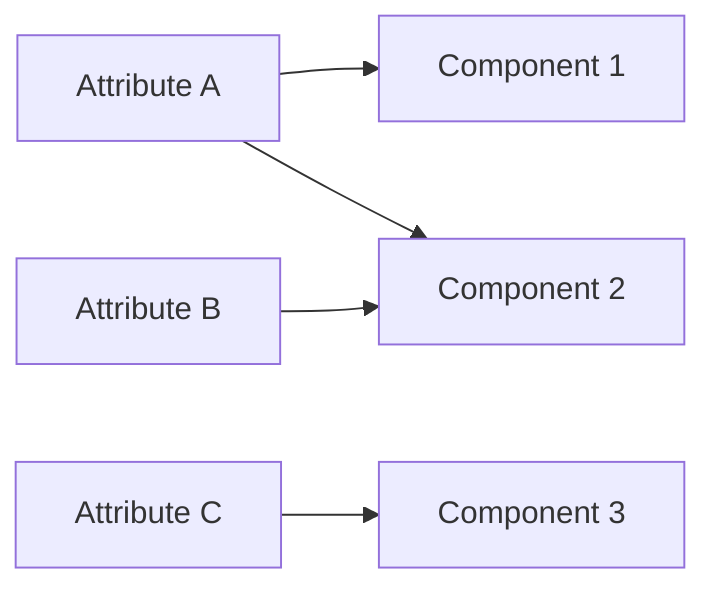

# [Supplemental Attributes](@id supplemental_attributes)

While the [`ext` field is a mechanism](@ref additional_fields) for adding arbitrary metadata. PowerSystems.jl, has moved towards a more structured and formalized way of handling supplemental data using `SupplementalAttribute` structs. This is designed to store metadata in a more organized fashion than a generic dictionary. These attributes are intended to be attached to a [`Component`](@ref) types.

Supplemmental attributes can be shared between components or have 1-1 relationships. This is particularly
useful to represent components in the same geographic location or outages for multiple components. Conversely, components can contain many attributes.



Supplemental attributes can also contain timeseries in the same fashion that a component can allowing the user to model time varying attributes like outage time series or weather dependent probabilities. See the section [`Working with Time Series Data`](@ref tutorial_time_series) for details on time series handling.

## Getting the attributes in a system

You can retrieve the attributes in a system using the function [`get_supplemental_attributes`](@ref).
You must pass a supplemental attribute type, which can be concrete or abstract. If you pass an abstract type, all concrete types
that are subtypes of the abstract type will be returned.

```julia
for outage in get_supplemental_attributes(FixedForcedOutage, system)
    @show summary(outage)
end
```

You can optionally pass a filter function to reduce the returned attributes. This example will
return only FixedForcedOutage instances that have a mean time to recovery greater than or equal to 0.5.

```julia
for outage in get_supplemental_attributes(
    x -> get_mean_time_to_recovery(x) >= 0.5,
    FixedForcedOutage,
    system,
)
    @show summary(outage)
end
```

## Getting the attributes associated with a component

You can retrieve the attributes associated with a component using the function [`get_supplemental_attributes`](@ref).
This method signatures are identical to the versions above that operate on a system; just swap the system for a component.

You must pass a supplemental attribute type, which can be concrete or abstract. If you pass an abstract type, all concrete types
that are subtypes of the abstract type will be returned.

```julia
gen1 = get_component(ThermalStandard, system, "gen1")
for outage in get_supplemental_attributes(FixedForcedOutage, gen)
    @show summary(outage)
end
```

You can optionally pass a filter function to reduce the returned attributes. This example will
return only FixedForcedOutage instances that have a mean time to recovery greater than or equal to 0.5.

```julia
for outage in get_supplemental_attributes(
    x -> get_mean_time_to_recovery(x) >= 0.5,
    gen,
    FixedForcedOutage,
)
    @show summary(outage)
end
```

## Getting the attributes associated with a component type

You can retrieve the attributes associated with any component of a given type
using the function [`get_associated_supplemental_attributes`](@ref). If one attribute is attached to
multiple components of the given type, it will still only appear once in the result.

 1. Get all the attributes associated with all components of a given type.

    ```julia
    for outage in get_associated_supplemental_attributes(system, ThermalStandard)
        @show summary(outage)
    end
    ```

 2. Same as #1, but filter the results by attribute type, which can be concrete or abstract.

    ```julia
    for outage in
        get_associated_supplemental_attributes(
        system,
        ThermalStandard;
        attribute_type = FixedForcedOutage,
    )
        @show summary(outage)
    end
    ```

## Getting the components associated with an attribute

You can retrieve the components associated with a single supplemental attribute using the
function [`get_associated_components`](@ref).

 1. Get all components associated with a single supplemental attribute.

    ```julia
    outage = first(get_supplemental_attributes(FixedForcedOutage, system))
    for component in get_associated_components(system, outage)
        @show summary(component)
    end
    ```

 2. Same as #1, but filter the results by component type, which can be concrete or abstract.

    ```julia
    outage = first(get_supplemental_attributes(FixedForcedOutage, system))
    for component in get_associated_components(system, outage; component_type = ThermalStandard)
        @show summary(component)
    end
    ```

## Getting the components associated with an attribute type

You can retrieve the components associated with any supplemental attribute of a given type
using the function [`get_associated_components`](@ref).

 1. Get all components associated with any supplemental attribute of a given type.

    ```julia
    for component in get_associated_components(system, FixedForcedOutage)
        @show summary(component)
    end
    ```

 2. Same as #1, but filter the results by component type, which can be concrete or abstract.

    ```julia
    for component in
        get_associated_components(system, FixedForcedOutage; component_type = ThermalStandard)
        @show summary(component)
    end
    ```

## Getting component / supplemental attribute pairs

The function [`get_component_supplemental_attribute_pairs`](@ref) returns a vector of component / supplemental
attribute pairs based on types and optional filters. This can be more efficient than double for loops
that iterate over components and their associated attributes independently.

```julia
for (gen, outage) in get_component_supplemental_attribute_pairs(
    ThermalStandard,
    FixedForcedOutage,
    system,
)
    @show summary(gen) summary(outage)
end
```

## Adding Time Series to an attribute

## Existing Supplemental Attributes in PowerSystems

  - [`GeographicInfo`](@ref)
  - [`ImpedanceCorrectionData`](@ref)

### Contingency Attributes

  - [`FixedForcedOutage`](@ref)
  - [`GeometricDistributionForcedOutage`](@ref)
  - [`PlannedOutage`](@ref)

### Plant Attributes

Plant attributes are a specialized category of supplemental attributes for grouping individual
generator units into logical plant structures. See [Plant Attributes](@ref plant_attributes)
for detailed documentation.

  - [`ThermalPowerPlant`](@ref) - Thermal plants with shared shafts
  - [`CombinedCycleBlock`](@ref) - Combined cycle plants with HRSG configurations
  - [`CombinedCycleFractional`](@ref) - Combined cycle plants with aggregate heat rate and exclusion groups
  - [`HydroPowerPlant`](@ref) - Hydro plants with shared penstocks
  - [`RenewablePowerPlant`](@ref) - Renewable plants with shared PCCs
