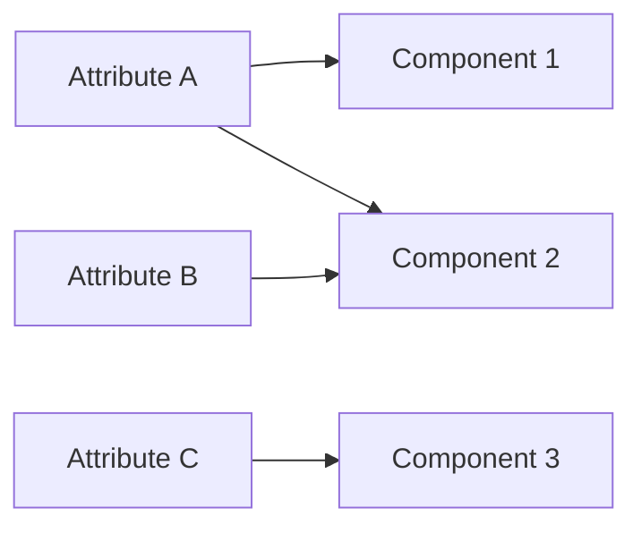

# [Supplemental Attributes](@id supplemental_attributes)

While the `ext` field is a mechanism for adding arbitrary metadata. PowerSystems.jl, has moved towards a more structured and formalized way of handling supplemental data using `SupplementalAttribute` structs. This is designed to store metadata in a more organized fashion than a generic dictionary. These attributes are intended to be attached to a [`Component`](@ref) types.

Supplemmental attributes can be shared between components or have 1-1 relationships. This is particularly
useful to represent components in the same geographic location or outages for multiple components. Conversely, components can contain many attributes.

Supplemental attributes can also contain timeseries in the same that a component can allowing the user to model time varying attributes like outage time series or weather dependent probabilities. See the section [`Working with Time Series Data`](@ref tutorial_time_series) for details on time series handling.

## Getting the attributes in a component or system

You can retrieve the attributes in a component using the function [`get_supplemental_attributes`](@ref)

## Getting the components in an attribute

## Adding Time Series to an attribute

## Existing Supplemental Attributes in PowerSystems

  - [`FixedForcedOutage`](@ref)
  - [`GeometricDistributionForcedOutage`](@ref)
  - [`PlannedOutage`](@ref)
  - [`GeographicInfo`](@ref)
  - [`ImpedanceCorrectionData`](@ref)
