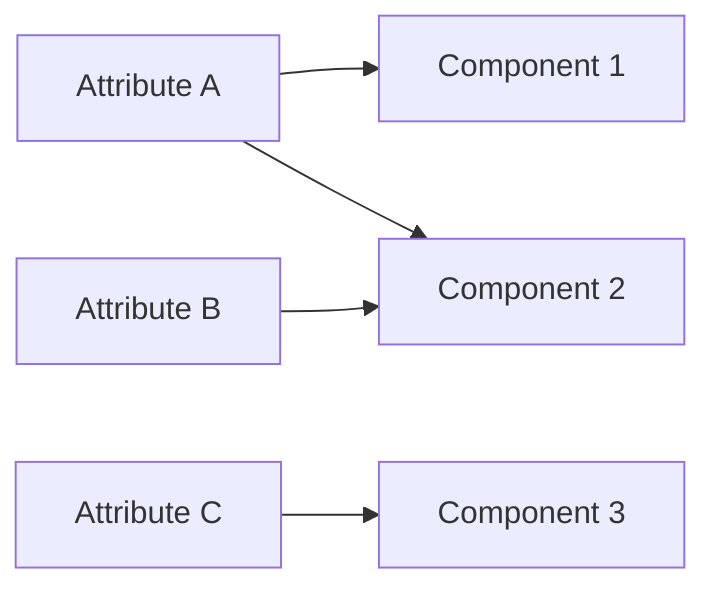

# [About Supplemental Attributes](@id supplemental_attributes_explanation)

Supplemental attributes help PowerSystems.jl manage the relationships between power system components and their metadata. Instead of putting everything into basic component definitions, this system keeps electrical data separate from contextual information like location, outages, or plant groupings.

## Why Use Supplemental Attributes?

Power system components exist in multiple contexts. A generator isn't just defined by its electrical properties—it also has a geographic location, belongs to a plant, and may share infrastructure with other units.

Traditional approaches used generic dictionary fields to store this extra information. But this created problems:

  - Data inconsistency across large systems
  - Maintenance difficulties
  - No validation of the information stored

Supplemental attributes solve this by using structured types instead of loose dictionaries. This provides:

**Clean separation**: Electrical behavior stays in component definitions. Everything else goes in attributes.

**Clear relationships**: The connections between components and their contexts are explicit and easy to query.

**Type safety**: The system validates data and gives helpful error messages when something's wrong.

## How Relationships Work

Supplemental attributes use many-to-many relationships. One attribute can connect to multiple components, and one component can have multiple attributes.

For example:

  - Multiple generators at the same plant share geographic coordinates
  - One weather pattern affects several plants in a region
  - Each generator might have its own maintenance schedule


```mermaid
flowchart LR
    A["Attribute A"] --> B["Component 1"]
    A -->  C["Component2"]
    D["Attribute B"] -->  C["Component 2"]
    E["Attribute C"] -->  F["Component 3"]
```

This flexibility matches how power systems actually work, where components share resources and are affected by common factors.

Supplemental attributes can be concrete or abstract. See the [Julia Types documentation](https://docs.julialang.org/en/v1/manual/ty) for more information on these types. Here is an example using the `PowerSystems.jl` Type Tree.

```@example types
using PowerSystems #hide
import TypeTree: tt #hide
docs_dir = joinpath(pkgdir(PowerSystems), "docs", "src", "tutorials", "utils"); #hide
include(joinpath(docs_dir, "docs_utils.jl")); #hide
print(join(tt(PowerSystems.IS.InfrastructureSystemsType), "")) #hide
```

The concrete supplemental attributes are the last ones listed in a section. For example, following the first few lines of the type tree: InfrastructureSystems.InfrastructureSystemsType > InfrastructureSystems.AbstractTimeSeriesParameters > InfrastructureSystems.ForecastParameters . InfrastructureSystems.ForecastParameters is the concrete supplemental attribute, and the abstract supplemental attribute is InfrastructureSystems.AbstractTimeSeriesParameters. Providing another example with: InfrastructureSystems.InfrastructureSystemsType > InfrastructureSystems.DeviceParameter > DynamicComponent > PowerSystems.DynamicGeneratorComponent > AVR > AVRFixed . AVRFixed is the concrete supplemental attributes, and the abstract supplemental attributes are the higher up layers.

## Time Series Support

Attributes can include time series data like weather patterns and planned outages.

## Benefits for Modelers

This design changes how you build power system models:

**Build in layers**: Start with electrical models, then add contextual information separately.

**Reuse data**: Geographic info and weather patterns can be applied to multiple systems.

**Work in teams**: Different people can work on electrical models and contextual data independently.

**Easy updates**: Change outage schedules or weather data without touching electrical models.

## Compared to Other Approaches

Other power system tools handle this differently:

**Heavy objects approach**: Some tools put all contextual data directly into component definitions. This makes objects large and unwieldy for big systems.

**External database approach**: Others store relationships in separate databases. This can slow things down and complicate deployment.

**PowerSystems.jl's approach**: Combines the speed of in-memory data with the relationship modeling power typically found only in databases. This works well for interactive analysis.

## Existing Supplemental Attributes in PowerSystems

  - [`GeographicInfo`](@ref)
  - [`ImpedanceCorrectionData`](@ref)

### Contingency Attributes

  - [`FixedForcedOutage`](@ref)
  - [`GeometricDistributionForcedOutage`](@ref)
  - [`PlannedOutage`](@ref)

#### Narrowing post-contingency monitoring

Every concrete [`Outage`](@ref) carries a `monitored_components` field of type
`Vector{Base.UUID}`. It identifies the [`Device`](@ref)s whose post-contingency
state a downstream simulation package (e.g., PowerSimulations) should model when
this outage occurs. Limiting the list reduces the number of post-outage variables
and constraints in security-constrained models.

PowerSystems itself does not attach meaning to the contents of the list. In
particular, an empty `monitored_components` is left for the consumer to
interpret — typical conventions are "monitor nothing" (skip post-contingency
modeling) or "monitor everything" (preserve full N-1 behavior). Pick the policy
that matches your downstream model.

The constructor accepts any iterable whose elements are `Base.UUID` or
`Device` — for example a `Vector`, a generator expression, or the iterator
returned by [`get_components`](@ref). Devices are converted to UUIDs
internally:

```julia
gen1 = get_component(ThermalStandard, system, "gen1")
gen2 = get_component(ThermalStandard, system, "gen2")
outage = FixedForcedOutage(;
    outage_status = 0.0,
    monitored_components = [gen1, gen2],
)
add_supplemental_attribute!(system, gen1, outage)

# Equivalent — every ThermalStandard in the system:
outage_all = FixedForcedOutage(;
    outage_status = 0.0,
    monitored_components = get_components(ThermalStandard, system),
)
```

Use the dedicated accessors to inspect or update the list at any time. The
singular `add_/remove_*!` methods take one `UUID` or `Device`; the plural
`add_/remove_*s!` and `set_` methods take any iterable of either.
`set_monitored_components!` requires the list to be empty — call
`clear_monitored_components!` first to replace an existing list:

```julia
get_monitored_components(outage)                                  # → Vector{UUID}
clear_monitored_components!(outage)                               # wipe
set_monitored_components!(outage, get_components(Line, system))   # populate (must be empty)
add_monitored_component!(outage, gen2)                            # append one (deduped)
add_monitored_components!(outage, [gen1, gen2])                   # append many
remove_monitored_component!(outage, gen1)                         # remove one
remove_monitored_components!(outage, [gen1, gen2])                # remove many
```

When `system.runchecks == true`, `add_supplemental_attribute!` resolves each
UUID against the parent system and raises an `ArgumentError` for any UUID that
does not point to a `Device` in the system. With `runchecks = false`, UUIDs are
accepted as-is and resolution is deferred to the consumer.

### Plant Attributes

Plant attributes are a specialized category of supplemental attributes for grouping individual
generator units into logical plant structures. See [Plant Attributes](@ref plant_attributes)
for detailed documentation.

  - [`ThermalPowerPlant`](@ref) - Thermal plants with shared shafts
  - [`CombinedCycleBlock`](@ref) - Combined cycle plants with HRSG configurations
  - [`CombinedCycleFractional`](@ref) - Combined cycle plants with aggregate heat rate and exclusion groups
  - [`HydroPowerPlant`](@ref) - Hydro plants with shared penstocks
  - [`RenewablePowerPlant`](@ref) - Renewable plants with shared PCCs

## Learn More

  - [Add Supplemental Attributes to a System](@ref add_supplemental_attributes) -- step-by-step guide for attaching attributes to components
  - [Supplemental Attributes](@ref) API reference -- complete listing of all supplemental attribute types, their fields, and associated functions
