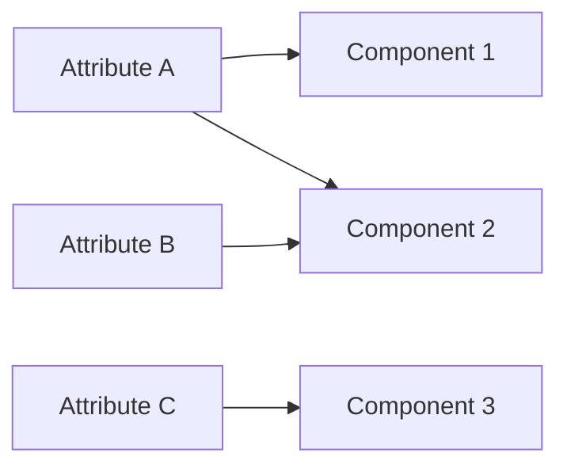

# [Supplemental attributes](@id supplemental_attributes_explanation)

[`SupplementalAttribute`](@ref) types hold contextual data linked to [`Component`](@ref)s —
information that sits outside each component's electrical definition. Geographic location,
outage schedules, plant groupings, emissions profiles, and PSS/e impedance correction tables
are typical examples. Keeping this metadata separate from component structs reflects how power
system datasets are actually organized: the same contextual fact often applies to many
devices, and it changes on a different schedule than network equipment data.

## Why separate contextual data from components?

Power system components exist in multiple contexts. A generator is not only defined by its
electrical properties — it also has a location, may belong to a plant, and may share
infrastructure with other units. Traditional approaches stored this extra information in
generic dictionary fields, which led to inconsistent data across large systems, difficult
maintenance, and no validation of what was stored.

Supplemental attributes address this by using structured types instead of loose dictionaries.
Electrical behavior stays in component definitions; contextual information lives in
attributes that can be attached, queried, and shared explicitly.

## How relationships work

Supplemental attributes use many-to-many relationships. One attribute can connect to
multiple components, and one component can have multiple attributes.

For example:

  - Multiple generators at the same plant can share geographic coordinates
  - One weather pattern can affect several plants in a region
  - Each generator might have its own maintenance schedule

```mermaid
flowchart LR
    A["Attribute A"] --> B["Component 1"]
    A --> C["Component 2"]
    D["Attribute B"] --> C
    E["Attribute C"] --> F["Component 3"]
```

This flexibility matches how power systems actually work, where components share resources
and are affected by common factors.

## Benefits for modelers

This design changes how you build power system models:

  - **Build in layers**: Start with electrical models, then add contextual information separately.
  - **Reuse data**: Geographic info and weather patterns can be applied to multiple systems.
  - **Work in teams**: Different people can work on electrical models and contextual data independently.
  - **Easy updates**: Change outage schedules or emissions profiles without touching electrical models.

## Compared to other approaches

Other power system tools handle contextual data differently:

**Heavy objects approach**: Some tools put all contextual data directly into component
definitions. This makes objects large and unwieldy for big systems.

**External database approach**: Others store relationships in separate databases. This can
slow things down and complicate deployment.

**PowerSystems.jl's approach**: Combines the speed of in-memory data with the relationship
modeling power typically found only in databases. This works well for interactive analysis.

## What kinds of contextual data are available?

PowerSystems.jl provides supplemental attribute types for common modeling needs. Each topic
has a dedicated explanation page and a matching how-to guide; field-level API details live
in the [Public API Reference](@ref) docstrings.

| Modeling need                                                     | Explanation                                                             | How-to                                                                                 |
|:----------------------------------------------------------------- |:----------------------------------------------------------------------- |:-------------------------------------------------------------------------------------- |
| Group units into plants (shafts, penstocks, PCCs, combined cycle) | [Grouping generators into plants](@ref grouping_generators_into_plants) | [Group generators into plants](@ref group_generators_into_plants)                      |
| Emissions rates and start-up adders                               | [Emissions metadata](@ref emissions_metadata)                           | [Add emissions to generators](@ref add_emissions_to_generators)                        |
| Planned and forced outages                                        | [Outage and contingency data](@ref outage_and_contingency_data)         | [Model Outages](@ref model_outages)                                                    |
| Geographic location (GeoJSON)                                     | *(this page)*                                                           | [Parse MATPOWER or PSS/e files](@ref pm_data) — auto-loaded from PSS/e v35 substations |
| PSS/e transformer impedance correction tables                     | *(this page)*                                                           | [Migrate from version 4.0 to 5.0](@ref psy5_migration)                                 |

[`GeographicInfo`](@ref) stores GeoJSON location metadata and can be shared across buses.
When parsing PSS/e v35 files with a substation section, coordinates are automatically
attached as [`GeographicInfo`](@ref) attributes. See [Parsing MATPOWER or PSS/e Files](@ref pm_data).

[`ImpedanceCorrectionData`](@ref) links a PSS/e Transformer Impedance Correction Table row
to a transformer. It is typically populated during PSS/e import rather than built by hand.

Attributes can include [time series data](@ref ts_data) — for example, planned outage
schedules and stochastic forced-outage probabilities.

## Learn more

  - [Attach supplemental data to components](@ref attach_contextual_data) — attach any supplemental attribute to a component
  - [Query contextual data on a system](@ref query_contextual_data) — retrieve attributes and their associations
  - [Hydro reservoir topology](@ref hydro_reservoir_topology) — linking reservoirs to turbines (component relationships, not supplemental attributes)
  - [Type Structure](@ref type_structure) — where supplemental attributes sit in the type hierarchy
