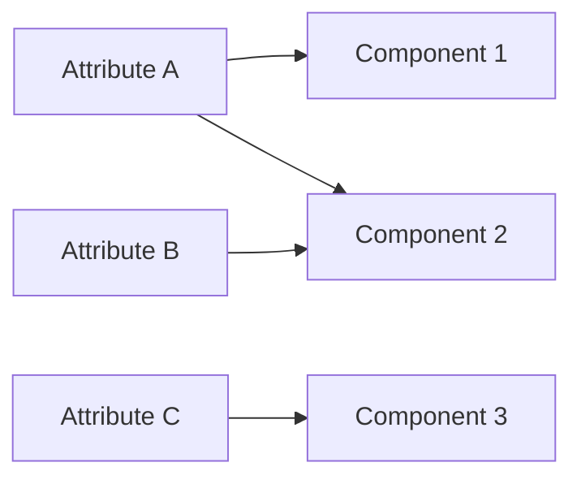

# [About Supplemental Attributes](@id supplemental_attributes_explanation)

Supplemental attributes help PowerSystems.jl manage the relationships between power system components and their metadata. Instead of cramming everything into basic component definitions, this system keeps electrical data separate from contextual information like location, outages, or plant groupings.

## Why Use Supplemental Attributes?

Power system components exist in multiple contexts. A generator isn't just defined by its electrical properties—it also has a geographic location, belongs to a plant, and may share infrastructure with other units.

Traditional approaches used generic dictionary fields to store this extra information. But this created problems:

  - Data inconsistency across large systems
  - Maintenance difficulties
  - No validation of the information stored

Supplemental attributes solve this by using structured types instead of loose dictionaries. This provides:

**Clean separation**: Electrical behavior stays in component definitions. Everything else goes in attributes.

**Clear relationships**: The connections between components and their contexts are explicit and easy to query.

**Type safety**: The system validates data and gives helpful error messages when something's wrong.

## How Relationships Work

Supplemental attributes use many-to-many relationships. One attribute can connect to multiple components, and one component can have multiple attributes.

For example:

  - Multiple generators at the same plant share geographic coordinates
  - One weather pattern affects several plants in a region
  - Each generator might have its own maintenance schedule

This flexibility matches how power systems actually work, where components share resources and are affected by common factors.

## Time Series Support

Attributes can include time series data like weather patterns and planned outages.

## Benefits for Modelers

This design changes how you build power system models:

**Build in layers**: Start with electrical models, then add contextual information separately.

**Reuse data**: Geographic info and weather patterns can be applied to multiple systems.

**Work in teams**: Different people can work on electrical models and contextual data independently.

**Easy updates**: Change outage schedules or weather data without touching electrical models.

## Compared to Other Approaches

Other power system tools handle this differently:

**Heavy objects approach**: Some tools put all contextual data directly into component definitions. This makes objects large and unwieldy for big systems.

**External database approach**: Others store relationships in separate databases. This can slow things down and complicate deployment.

**PowerSystems.jl's approach**: Combines the speed of in-memory data with the relationship modeling power typically found only in databases. This works well for interactive analysis.

## Existing Supplemental Attributes in PowerSystems

  - [`GeographicInfo`](@ref)
  - [`ImpedanceCorrectionData`](@ref)

### Contingency Attributes

  - [`FixedForcedOutage`](@ref)
  - [`GeometricDistributionForcedOutage`](@ref)
  - [`PlannedOutage`](@ref)

### Plant Attributes

Plant attributes are a specialized category of supplemental attributes for grouping individual
generator units into logical plant structures. See [Plant Attributes](@ref plant_attributes)
for detailed documentation.

  - [`ThermalPowerPlant`](@ref) - Thermal plants with shared shafts
  - [`CombinedCycleBlock`](@ref) - Combined cycle plants with HRSG configurations
  - [`CombinedCycleFractional`](@ref) - Combined cycle plants with aggregate heat rate and exclusion groups
  - [`HydroPowerPlant`](@ref) - Hydro plants with shared penstocks
  - [`RenewablePowerPlant`](@ref) - Renewable plants with shared PCCs

## Learn More

For more information about supplemental attributes, see the [Supplemental Attributes](@ref) API reference.
