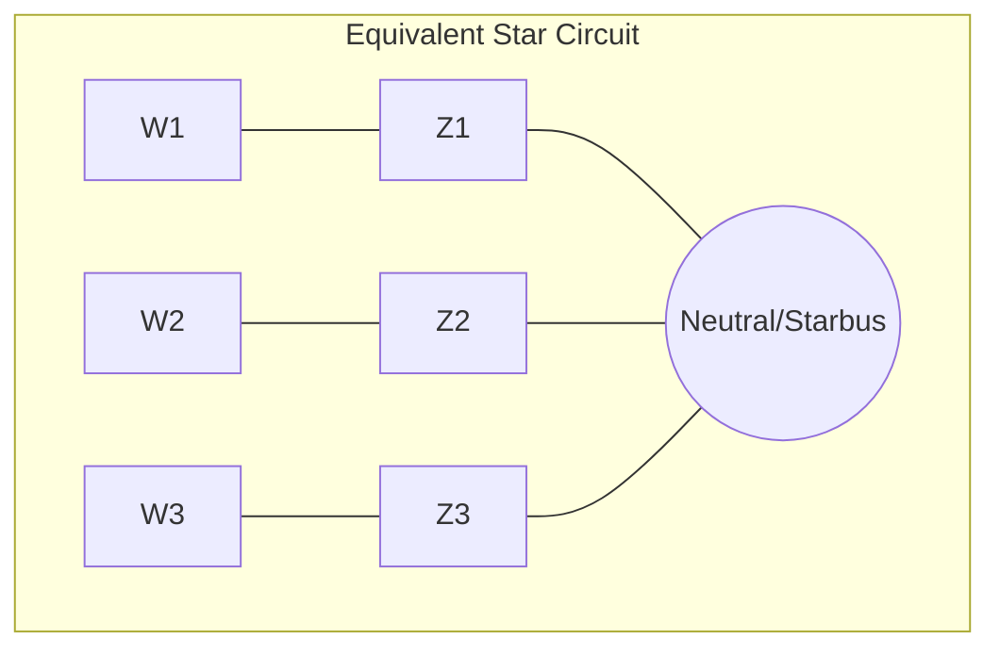

# [3-winding transformer representation](@id 3wtdata)

`PowerSystems.jl` stores the topological data for the [`Transformer3W`](@ref) as the common equivalent circuit in the star (or wye) configuration. In this representation, the series impedances of each winding are transformed into an equivalent star network with a common star bus.

## The "Starbus" Representation

The measured pairwise leakage impedances $Z_{12}, Z_{23},$ and $Z_{13}$ between each pair of windings are converted into the equivalent star impedances $Z_1, Z_2,$ and $Z_3$. The common point of this star network is the conceptual "starbus" or internal neutral node. Each winding's terminal in the power system network is then connected to its corresponding impedance in this equivalent star.

## Representing 3-winding transformer PSSe Data in `PowerSystems.jl`

PSS®E represents a [`Transformer3W`](@ref) as a single element with a dedicated data record. This record contains several fields that define the transformer's characteristics and connections. The key information stored includes:

### Bus Connections in Delta configuration

  - From Bus Number (I): The bus number connected to the primary winding.
  - To Bus Number (J): The bus number connected to the secondary winding.
  - Third Bus Number (K): The bus number connected to the tertiary winding.
  - Circuit Identifier (ID): An alphanumeric identifier to distinguish between multiple transformers connected between the same buses.
  - Impedance Data: PSS®E uses the concept of leakage impedances between the windings to model the transformer.

It does not explicitly store the equivalent star (wye) impedances. Instead, it stores the following:

  - Positive Sequence Impedance (R1-2, X1-2): Resistance and reactance between winding 1 (primary) and winding 2 (secondary).

  - Positive Sequence Impedance (R1-3, X1-3): Resistance and reactance between winding 1 (primary) and winding 3 (tertiary).

  - Positive Sequence Impedance (R2-3, X2-3): Resistance and reactance between winding 2 (secondary) and winding 3 (tertiary).

  - Star Bus Number: The star bus number is optional and it might be represented or not.

The per-unit base of the impedance fields depends on the record's CZ flag: system base MVA
when CZ = 1, or the corresponding winding-pair base (SBASE1-2, etc.) when CZ = 2. The
parser handles both conventions.

### Magnetizing Admittance

  - Magnetizing Admittance (MAG1, MAG2): Core loss conductance and magnetizing susceptance, referred to the winding 1 bus. The base depends on the record's CM flag: per-unit on the system base when CM = 1, or no-load loss in watts and exciting current when CM = 2.

### Tap Settings and Phase Shift

  - Winding Tap Ratios (WINDV1, WINDV2, WINDV3): Off-nominal turns ratio of each winding, either in per-unit of the connected bus base voltage (CW = 1) or as a winding voltage in kV (CW = 2).
  - Nominal Voltages (NOMV1, NOMV2, NOMV3): Nominal (rated) voltage of each winding in kV.
  - Phase Shift (ANG1, ANG2, ANG3): Phase shift in degrees applied by each winding.

### Winding Ratings

  - Winding 1 MVA Base (SBASE1-2): Base apparent power for the winding 1-2 pair.
  - Winding 2 MVA Base (SBASE2-3): Base apparent power for the winding 2-3 pair.
  - Winding 3 MVA Base (SBASE3-1): Base apparent power for the winding 3-1 pair.

### Control Information (Optional)

For transformers with on-load tap changers (OLTCs) or phase shifters, additional data related to the control parameters (controlled bus, voltage setpoint, tap limits, etc.) would be included in the relevant control records, not directly within the transformer data record itself.

## Deriving the Equivalent Star Impedances from PSSe

In `PowerSystems.jl`, we explicitly represent and store the [`Transformer3W`](@ref) as an equivalent star (wye) circuit with a common neutral point (often referred to conceptually as a "starbus"), we calculate the equivalent series impedance for each winding ($Z_1, Z_2, Z_3$) from the PSS®E Positive Sequence Impedance data (e.g., R1-2, X1-2, etc.) using the following formulas:

$$\begin{aligned}
Z_1 &= \frac{1}{2} (Z_{12} + Z_{13} - Z_{23}) \\
Z_2 &= \frac{1}{2} (Z_{12} + Z_{23} - Z_{13}) \\
Z_3 &= \frac{1}{2} (Z_{13} + Z_{23} - Z_{12})
\end{aligned}$$

Where:

  - ``Z_1``: Equivalent series impedance of winding 1, connected between its terminal and the neutral point of the equivalent star.
  - ``Z_2``: Equivalent series impedance of winding 2, connected between its terminal and the neutral point of the equivalent star.
  - ``Z_3``: Equivalent series impedance of winding 3, connected between its terminal and the neutral point of the equivalent star.

We store the data from both representations (Delta and Wye) for completeness as well as the star bus used in the wye representation.
