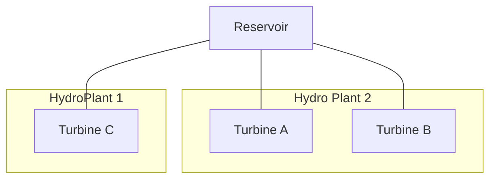
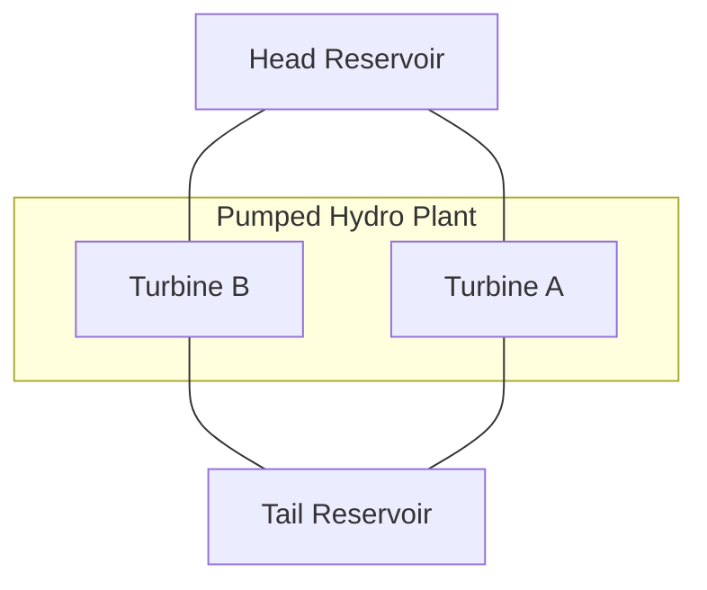

# [Create Hydropower Datasets with Reservoirs](@id hydro_resv)

In the current version of `PowerSystems.jl` there is support and testing for hydropower generation plants with the following structures:

## Shared upstream reservoir

It is possible to attach an upstream reservoir to any number of turbines with different power house elevations to consider the effect of the elevation and pressure heads
on the specific turbines inside of a power plant.

## Head and Tail Reservoirs for Pumped Hydropower Plants

The turbine and reservoirs structs store the elevations in each case calculate adequately the elevation and pressure heads for
the facility.

