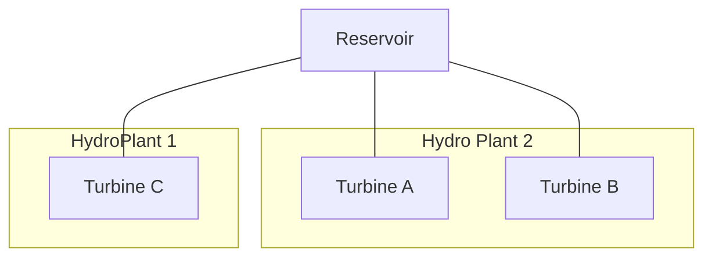
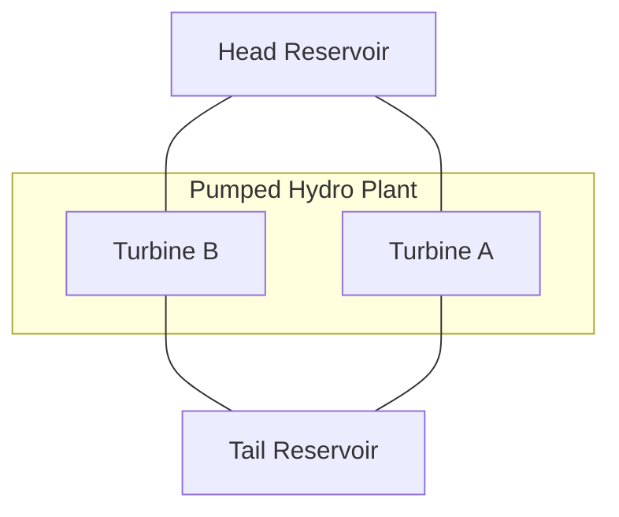

# [Define Hydro Generators with Reservoirs](@id hydro_resv)

In the current version of `PowerSystems.jl` there is support and testing for hydropower generation plants with the following structures:

## Shared upstream reservoir

For this model, attach an upstream [`HydroReservoir`](@ref) to any number of [`HydroTurbine`](@ref)s. This can model different power house elevations to consider the effect of the elevation and pressure heads
on the specific turbines inside of a power plant.

## Head and Tail Reservoirs for Pumped Hydropower Plants

For this model, attach two [`HydroReservoir`](@ref)s to any number of [`HydroPumpTurbine`](@ref)s. The turbine and reservoirs structs store the elevations in each case calculate adequately the elevation and pressure heads for
the facility.

## Units for the [`HydroReservoir`](@ref) objects

The [`HydroReservoir`](@ref) can specify which units of measurement are used perform the energy balance calculations. The reservoir limits can take level units which affect how the totals and
targets are calculated.

  - USABLE_VOLUME: The volume of water that can be stored for levels between the penstock
    intetake and the top reservoir level:
  - TOTAL_VOLUME: The total volume of the reservoir considering a total depletion of the
    water levels. This unit system usually requires the specification of a valid minimum volume level.
  - HEAD: The difference in elevations between the top water levels. It requiers a valid conversion constant to go from head to potential energy stored.
  - ENERGY: Uses energy units in MWh to approximate the water storage as a generic energy reservoir.

The user is responsible for managing correctly the conversions between the different alternatives.
