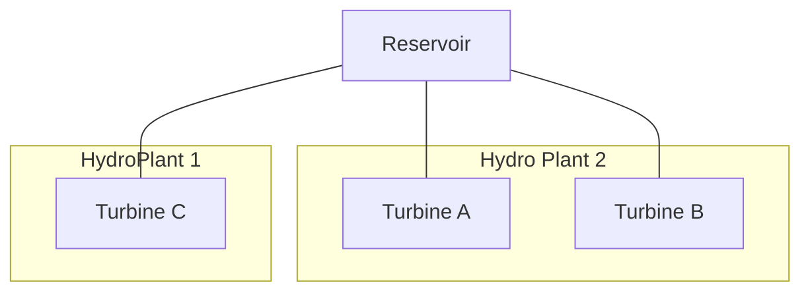
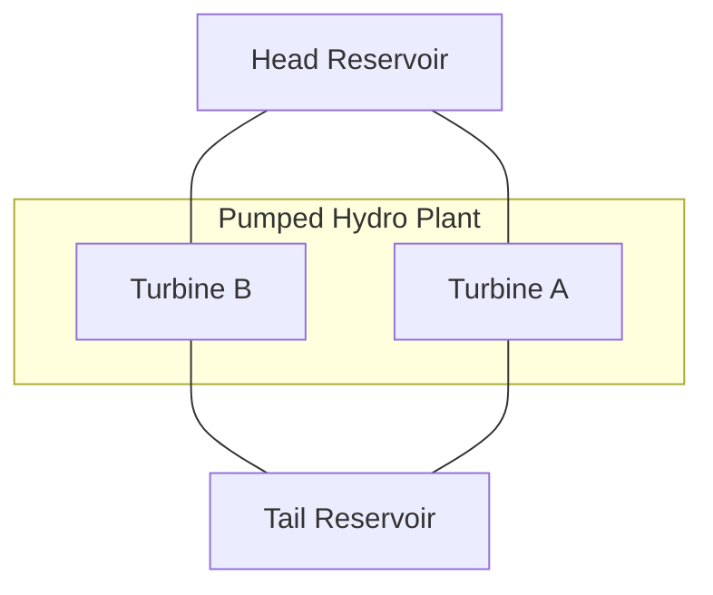

# [Define Hydro Generators with Reservoirs](@id hydro_resv)

In the current version of `PowerSystems.jl` there is support and testing for hydropower generation plants with the following structures:

## Shared Upstream Reservoir



For this model, attach an upstream [`HydroReservoir`](@ref) to any number of [`HydroTurbine`](@ref)s. This can model different power house elevations to consider the effect of the elevation and pressure heads on the specific turbines inside of a power plant.

### Example: Single Turbine with Single Reservoir

```julia
using PowerSystems
const PSY = PowerSystems

# Create a system
sys = System(100.0)
set_units_base_system!(sys, "NATURAL_UNITS")

# Create and add a bus
bus = ACBus(;
    number = 1,
    name = "bus1",
    available = true, 
    bustype = ACBusTypes.PV,
    angle = 0.0,
    magnitude = 1.0,
    voltage_limits = (min = 0.9, max = 1.1),
    base_voltage = 230.0,
    area = nothing,
    load_zone = nothing,
)
add_component!(sys, bus)

# Create a HydroTurbine
turbine = HydroTurbine(;
    name = "Turbine1",
    available = true,
    bus = bus,
    active_power = 50.0,
    reactive_power = 10.0,
    rating = 100.0,
    base_power = 100.0,
    active_power_limits = (min = 10.0, max = 100.0),
    reactive_power_limits = (min = -50.0, max = 50.0),
    powerhouse_elevation = 500.0,  # meters above sea level
    efficiency = 0.9,
    conversion_factor = 1.0,
    outflow_limits = (min = 0.0, max = 1000.0),  # m³/s
    travel_time = 0.5,  # hours
)
add_component!(sys, turbine)

# Create a HydroReservoir
reservoir = HydroReservoir(;
    name = "Reservoir1",
    available = true,
    storage_level_limits = (min = 1000.0, max = 10000.0),  # m³
    initial_level = 0.8,  # 80% of max
    spillage_limits = (min = 0.0, max = 500.0),
    inflow = 100.0,  # m³/h
    outflow = 50.0,  # m³/h
    level_targets = 0.7,
    intake_elevation = 600.0,  # meters above sea level
    head_to_volume_factor = LinearCurve(1.0),
)
add_component!(sys, reservoir)

# Link the turbine to the reservoir as a downstream turbine
set_downstream_turbine!(reservoir, turbine)

# Verify the connection
@assert has_downstream_turbine(reservoir, turbine)
@assert length(get_connected_head_reservoirs(sys, turbine)) == 1
```

### Example: Multiple Turbines with Single Reservoir

```julia

sys = System(100.0)
set_units_base_system!(sys, "NATURAL_UNITS")

# Create and add a bus
bus = ACBus(;
    number = 1,
    name = "bus1",
    available = true,
    bustype = ACBusTypes.PV,
    angle = 0.0,
    magnitude = 1.0,
    voltage_limits = (min = 0.9, max = 1.1),
    base_voltage = 230.0,
    area = nothing,
    load_zone = nothing,
)
add_component!(sys, bus)
# Create multiple turbines and connect them to a single reservoir
turbines = []
for i in 1:5
    turbine = HydroTurbine(;
        name = "Turbine$i",
        available = true,
        bus = bus,
        active_power = 20.0,
        reactive_power = 5.0,
        rating = 50.0,
        base_power = 100.0,
        active_power_limits = (min = 5.0, max = 50.0),
        reactive_power_limits = nothing,
        powerhouse_elevation = 500.0 + i * 10.0,  # Different elevations
        efficiency = 0.85 + i * 0.02,
    )
    add_component!(sys, turbine)
    push!(turbines, turbine)
end

# Link all turbines at once
set_downstream_turbines!(reservoir, turbines)

# Verify connections
@assert has_downstream_turbine(reservoir)
@assert length(get_downstream_turbines(reservoir)) == 5
```

## Head and Tail Reservoirs for Pumped Hydropower Plants

For this model, attach two [`HydroReservoir`](@ref)s to any number of [`HydroPumpTurbine`](@ref)s. The turbine and reservoir structs store the elevations to calculate the elevation and pressure heads for the facility.



### Example: Pumped Hydro with Head and Tail Reservoirs

```julia
# Create a HydroPumpTurbine
pump_turbine = HydroPumpTurbine(;
    name = "PumpTurbine1",
    available = true,
    bus = bus,
    active_power = 50.0,
    reactive_power = 10.0,
    rating = 200.0,
    active_power_limits = (min = 20.0, max = 200.0),  # Generation mode
    reactive_power_limits = (min = -100.0, max = 100.0),
    active_power_limits_pump = (min = 30.0, max = 180.0),  # Pumping mode
    outflow_limits = (min = 0.0, max = 500.0),
    powerhouse_elevation = 400.0,
    base_power = 100.0,
    ramp_limits = (up = 20.0, down = 20.0),
    time_limits = nothing,
    status = PSY.PumpHydroStatusModule.PumpHydroStatus.OFF,
    time_at_status = 0.0,
    efficiency = (turbine = 0.9, pump = 0.85),
    transition_time = (turbine = 0.25, pump = 0.25),  # hours
    minimum_time = (turbine = 1.0, pump = 1.0),  # hours
    conversion_factor = 1.0,
)
add_component!(sys, pump_turbine)

# Create head (upper) reservoir
head_reservoir = HydroReservoir(;
    name = "HeadReservoir",
    available = true,
    storage_level_limits = (min = 5000.0, max = 50000.0),
    initial_level = 0.6,
    spillage_limits = nothing,
    inflow = 200.0,
    outflow = 100.0,
    level_targets = 0.5,
    intake_elevation = 800.0,
    head_to_volume_factor = LinearCurve(1.0),
)
add_component!(sys, head_reservoir)

# Create tail (lower) reservoir
tail_reservoir = HydroReservoir(;
    name = "TailReservoir",
    available = true,
    storage_level_limits = (min = 3000.0, max = 30000.0),
    initial_level = 0.4,
    spillage_limits = nothing,
    inflow = 50.0,
    outflow = 100.0,
    level_targets = 0.5,
    intake_elevation = 200.0,
    head_to_volume_factor = LinearCurve(1.0),
)
add_component!(sys, tail_reservoir)

# Link reservoirs to pump-turbine
# Head reservoir feeds into the turbine (downstream)
set_downstream_turbine!(head_reservoir, pump_turbine)

# Tail reservoir receives flow from the turbine (upstream)
set_upstream_turbine!(tail_reservoir, pump_turbine)

# Verify connections
@assert has_downstream_turbine(head_reservoir, pump_turbine)
@assert has_upstream_turbine(tail_reservoir, pump_turbine)
@assert length(get_connected_head_reservoirs(sys, pump_turbine)) == 1
@assert length(get_connected_tail_reservoirs(sys, pump_turbine)) == 1
```

## Key Component Fields

### HydroTurbine

Key fields for [`HydroTurbine`](@ref):

  - `powerhouse_elevation::Float64`: Height in meters above sea level of the powerhouse
  - `efficiency::Float64`: Turbine efficiency [0, 1.0]
  - `turbine_type::HydroTurbineType`: Type of turbine (e.g., `HydroTurbineType.UNKNOWN`, `HydroTurbineType.FRANCIS`, `HydroTurbineType.PELTON`, `HydroTurbineType.KAPLAN`)
  - `conversion_factor::Float64`: Conversion factor from flow/volume to energy (m³ -> p.u-hr)
  - `outflow_limits::Union{Nothing, MinMax}`: Turbine outflow limits in m³/s
  - `travel_time::Union{Nothing, Float64}`: Downstream travel time in hours from reservoir to turbine

### HydroReservoir

Key fields for [`HydroReservoir`](@ref):

  - `storage_level_limits::MinMax`: Storage level limits (in m³, m, or MWh based on `level_data_type`)
  - `initial_level::Float64`: Initial level as fraction of `storage_level_limits.max`
  - `inflow::Float64`: Water refilling the reservoir (m³/h or MW)
  - `outflow::Float64`: Water naturally leaving the reservoir (m³/h or MW)
  - `spillage_limits::Union{Nothing, MinMax}`: Water spillage limits
  - `level_targets::Union{Nothing, Float64}`: Target level at simulation end as fraction of max
  - `intake_elevation::Float64`: Height of intake in meters above sea level
  - `head_to_volume_factor::ValueCurve`: Head to volume relationship
  - `upstream_turbines::Vector{HydroUnit}`: Turbines feeding into this reservoir (tail reservoir)
  - `downstream_turbines::Vector{HydroUnit}`: Turbines fed by this reservoir (head reservoir)
  - `upstream_reservoirs::Vector{Device}`: Reservoirs feeding spillage into this reservoir
  - `level_data_type::ReservoirDataType`: Data type (e.g., `ReservoirDataType.USABLE_VOLUME`, `ReservoirDataType.HEAD`, `ReservoirDataType.ENERGY`)

### HydroPumpTurbine

Key fields specific to [`HydroPumpTurbine`](@ref):

  - `active_power_limits::MinMax`: Power limits for turbine (generation) mode
  - `active_power_limits_pump::MinMax`: Power limits for pump mode
  - `status::PumpHydroStatus`: Operating status (`PumpHydroStatus.OFF`, `PumpHydroStatus.PUMP`, `PumpHydroStatus.GEN`)
  - `efficiency::TurbinePump`: Separate efficiencies for turbine and pump modes `(turbine = 0.9, pump = 0.85)`
  - `transition_time::TurbinePump`: Time to switch modes `(turbine = 0.25, pump = 0.25)`
  - `minimum_time::TurbinePump`: Minimum operating time in each mode `(turbine = 1.0, pump = 1.0)`

## Helper Functions

### Linking Turbines to Reservoirs

  - `set_downstream_turbine!(reservoir, turbine)`: Link a single turbine as downstream of reservoir
  - `set_downstream_turbines!(reservoir, turbines)`: Link multiple turbines as downstream
  - `set_upstream_turbine!(reservoir, turbine)`: Link a single turbine as upstream of reservoir
  - `set_upstream_turbines!(reservoir, turbines)`: Link multiple turbines as upstream

### Checking Connections

  - `has_downstream_turbine(reservoir)`: Check if any downstream turbines are attached
  - `has_downstream_turbine(reservoir, turbine)`: Check if specific turbine is downstream
  - `has_upstream_turbine(reservoir)`: Check if any upstream turbines are attached
  - `has_upstream_turbine(reservoir, turbine)`: Check if specific turbine is upstream

### Retrieving Connected Components

  - `get_downstream_turbines(reservoir)`: Get vector of downstream turbines
  - `get_upstream_turbines(reservoir)`: Get vector of upstream turbines
  - `get_connected_head_reservoirs(sys, turbine)`: Get reservoirs where turbine is downstream
  - `get_connected_tail_reservoirs(sys, turbine)`: Get reservoirs where turbine is upstream
  - `get_turbine_head_reservoirs_mapping(sys)`: Get mapping of all turbines to head reservoirs
  - `get_turbine_tail_reservoirs_mapping(sys)`: Get mapping of all turbines to tail reservoirs

### Removing Connections

  - `remove_turbine!(reservoir, turbine)`: Remove a specific turbine connection
  - `clear_turbines!(reservoir)`: Remove all turbine connections from reservoir
