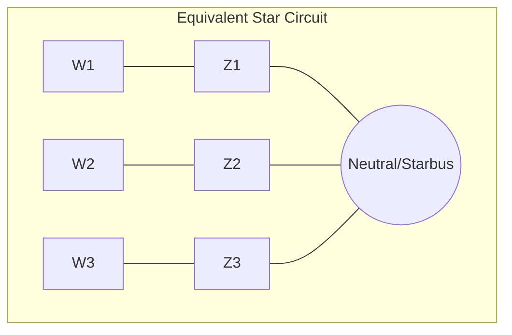

# [Handle 3-winding transformer data](@id 3wtdata)

PowerSystems.jl stores the topological data for the [`Transformer3W`](@ref) as the common equivalent circuit in the star (or wye) configuration. In this representation, the series impedances of each winding are transformed into an equivalent star network with a common star bus.

## The "Starbus" Representation

The resulting $Z_{12}, Z_{23},$ and $Z_{13}$ represent the series impedances in a star network. The common point of this star network is the conceptual "starbus" or internal neutral node. Each winding's terminal in the power system network is then connected to its corresponding impedance in this equivalent star.

## Representing 3-winding transformer PSSe Data in `PowerSystems.jl`

PSS®E represents a [`Transformer3W`](@ref) as a single element with a dedicated data record. This record contains several fields that define the transformer's characteristics and connections. The key information stored includes:

### Bus Connections in Delta configuration

  - From Bus Number (I): The bus number connected to the primary winding.
  - To Bus Number (J): The bus number connected to the secondary winding.
  - Third Bus Number (K): The bus number connected to the tertiary winding.
  - Circuit Identifier (ID): An alphanumeric identifier to distinguish between multiple transformers connected between the same buses.
  - Impedance Data: PSS®E uses the concept of leakage impedances between the windings to model the transformer.

It does not explicitly store the equivalent star (wye) impedances. Instead, it stores the following:

  - Positive Sequence Impedance (R1-2, X1-2): Resistance and reactance between winding 1 (primary) and winding 2 (secondary) in per-unit on the transformer's base MVA.

  - Positive Sequence Impedance (R1-3, X1-3): Resistance and reactance between winding 1 (primary) and winding 3 (tertiary) in per-unit on the transformer's base MVA.

  - Positive Sequence Impedance (R2-3, X2-3): Resistance and reactance between winding 2 (secondary) and winding 3 (tertiary) in per-unit on the transformer's base MVA.

  - Star Bus Number: The star bus number is optional and it might be represented or not.

### Magnetizing Admittance

  - Magnetizing Conductance (GMAG1): Core loss conductance in per-unit on the transformer's base MVA, usually referred to the primary winding.
  - Magnetizing Susceptance (BMAG1): Magnetizing susceptance in per-unit on the transformer's base MVA, usually referred to the primary winding.

### Tap Settings and Phase Shift

  - Winding 1 Tap Ratio (RATIO1): Tap ratio for the primary winding.
  - Winding 2 Tap Ratio (RATIO2): Tap ratio for the secondary winding.
  - Winding 3 Tap Ratio (RATIO3): Tap ratio for the tertiary winding.
  - Phase Shift (ANGLE1, ANGLE2, ANGLE3): Phase shift in degrees applied by each winding.

### Winding Ratings

  - Winding 1 MVA Base (SBASE1): Base apparent power for winding 1.
  - Winding 2 MVA Base (SBASE2): Base apparent power for winding 2.
  - Winding 3 MVA Base (SBASE3): Base apparent power for winding 3.
  - Nominal Voltages (WINDV1, WINDV2, WINDV3): Nominal voltage levels of each winding in kV.

### Control Information (Optional)

For transformers with on-load tap changers (OLTCs) or phase shifters, additional data related to the control parameters (controlled bus, voltage setpoint, tap limits, etc.) would be included in the relevant control records, not directly within the transformer data record itself.

## Deriving the Equivalent Star Impedances from PSSe

In `PowerSystems.jl`, we explictly represent and store the [`Transformer3W`](@ref) as an equivalent star (wye) circuit with a common neutral point (often referred to conceptually as a "starbus"), we calculate the equivalent series impedance for each winding ($Z_1, Z_2, Z_3$) from the PSS®E Positive Sequence Impedance data (e.g., R1-2, X1-2, etc.) using the following formulas:

$$\begin{aligned}
Z_1 &= \frac{1}{2} (Z_{12} + Z_{13} - Z_{23}) \\
Z_2 &= \frac{1}{2} (Z_{12} + Z_{23} - Z_{13}) \\
Z_3 &= \frac{1}{2} (Z_{13} + Z_{23} - Z_{12})
\end{aligned}$$

Where:

  - $Z_1$: Equivalent series impedance of winding 1, connected between its terminal and the neutral point of the equivalent star.
  - $Z_2$: Equivalent series impedance of winding 2, connected between its terminal and the neutral point of the equivalent star.
  - $Z_3$: Equivalent series impedance of winding 3, connected between its terminal and the neutral point of the equivalent star.

We store the data from both representations (Delta and Wye) for completeness as well as the star bus used in the wye representation.
