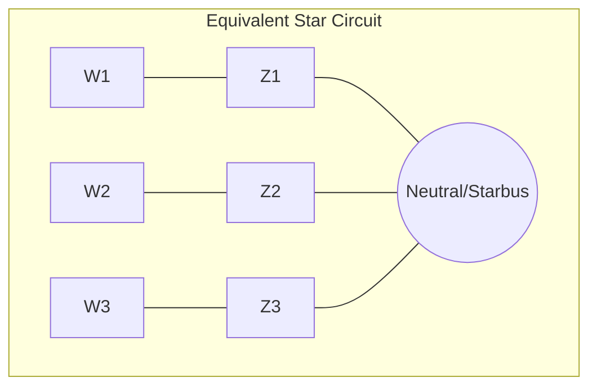

# [Handle 3-winding transformer data](@id 3wtdata)

PowerSystems.jl models the [`ThreeWindingTransformer`](@ref) with a star (or wye) topology: three [`TransformerCircuit`](@ref)s ([`get_primary_circuit`](@ref), [`get_secondary_circuit`](@ref), [`get_tertiary_circuit`](@ref)), each connecting a terminal bus to a common star (hidden) bus ([`get_star_bus`](@ref)). PowerSystems.jl does **not** store or compute the equivalent star-leg impedances $Z_1, Z_2, Z_3$ themselves. It stores only the measured (PSS/E-shaped) pairwise impedances `r_12`/`x_12`, `r_23`/`x_23`, `r_31`/`x_31` between winding pairs, on their respective per-pair base powers. Deriving the star-leg impedances from these pairwise values is left to downstream packages — PowerNetworkMatrices owns the cached star derivation used for network-matrix assembly.

## The "Starbus" Representation

The star bus is the common point of this star topology: the conceptual "starbus" or internal neutral node. Each winding's terminal in the power system network is connected through an equivalent series impedance ($Z_1$, $Z_2$, $Z_3$ below) to this star bus. These per-leg impedances are not stored on the component; they are derived downstream from the stored pairwise data (see [Deriving the Equivalent Star Impedances from PSSe](@ref) below).

```mermaid
graph TD
    subgraph Equivalent Star Circuit
        N((Neutral/Starbus))
        W1 --- Z1 --- N
        W2 --- Z2 --- N
        W3 --- Z3 --- N
    end
```

## Representing 3-winding transformer PSSe Data in `PowerSystems.jl`

PSS®E represents a [`ThreeWindingTransformer`](@ref) as a single element with a dedicated data record. This record contains several fields that define the transformer's characteristics and connections. The key information stored includes:

### Bus Connections in Delta configuration

  - From Bus Number (I): The bus number connected to the primary winding.
  - To Bus Number (J): The bus number connected to the secondary winding.
  - Third Bus Number (K): The bus number connected to the tertiary winding.
  - Circuit Identifier (ID): An alphanumeric identifier to distinguish between multiple transformers connected between the same buses.
  - Impedance Data: PSS®E uses the concept of leakage impedances between the windings to model the transformer.

It does not explicitly store the equivalent star (wye) impedances. Instead, it stores the following:

  - Positive Sequence Impedance (R1-2, X1-2): Resistance and reactance between winding 1 (primary) and winding 2 (secondary) in per-unit on the transformer's base MVA.

  - Positive Sequence Impedance (R1-3, X1-3): Resistance and reactance between winding 1 (primary) and winding 3 (tertiary) in per-unit on the transformer's base MVA.

  - Positive Sequence Impedance (R2-3, X2-3): Resistance and reactance between winding 2 (secondary) and winding 3 (tertiary) in per-unit on the transformer's base MVA.

  - Star Bus Number: The star bus number is optional and it might be represented or not.

### Magnetizing Admittance

  - Magnetizing Conductance (GMAG1): Core loss conductance in per-unit on the transformer's base MVA, usually referred to the primary winding.
  - Magnetizing Susceptance (BMAG1): Magnetizing susceptance in per-unit on the transformer's base MVA, usually referred to the primary winding.

### Tap Settings and Phase Shift

  - Winding 1 Tap Ratio (RATIO1): Tap ratio for the primary winding.
  - Winding 2 Tap Ratio (RATIO2): Tap ratio for the secondary winding.
  - Winding 3 Tap Ratio (RATIO3): Tap ratio for the tertiary winding.
  - Phase Shift (ANGLE1, ANGLE2, ANGLE3): Phase shift in degrees applied by each winding.

### Winding Ratings

  - Winding 1 MVA Base (SBASE1): Base apparent power for winding 1.
  - Winding 2 MVA Base (SBASE2): Base apparent power for winding 2.
  - Winding 3 MVA Base (SBASE3): Base apparent power for winding 3.
  - Nominal Voltages (WINDV1, WINDV2, WINDV3): Nominal voltage levels of each winding in kV.

### Control Information (Optional)

For transformers with on-load tap changers (OLTCs) or phase shifters, additional data related to the control parameters (controlled bus, voltage setpoint, tap limits, etc.) would be included in the relevant control records, not directly within the transformer data record itself.

## Deriving the Equivalent Star Impedances from PSSe

In `PowerSystems.jl`, the [`ThreeWindingTransformer`](@ref) stores only the measured (delta) pairwise impedances `r_12`/`x_12`, `r_23`/`x_23`, `r_31`/`x_31` (accessed with [`get_r_12`](@ref) etc.) on their respective `base_power_12`/`base_power_23`/`base_power_31` bases, plus the star bus ([`get_star_bus`](@ref)). The equivalent star (wye) series impedance for each winding ($Z_1, Z_2, Z_3$) is *not* stored directly; it is derived on demand — for example by PowerNetworkMatrices — from the PSS®E Positive Sequence Impedance data (e.g., R1-2, X1-2, etc.) using the following formulas:

$$\begin{aligned}
Z_1 &= \frac{1}{2} (Z_{12} + Z_{31} - Z_{23}) \\
Z_2 &= \frac{1}{2} (Z_{12} + Z_{23} - Z_{31}) \\
Z_3 &= \frac{1}{2} (Z_{31} + Z_{23} - Z_{12})
\end{aligned}$$

Where:

  - $Z_1$: Equivalent series impedance of winding 1, connected between its terminal and the neutral point of the equivalent star.
  - $Z_2$: Equivalent series impedance of winding 2, connected between its terminal and the neutral point of the equivalent star.
  - $Z_3$: Equivalent series impedance of winding 3, connected between its terminal and the neutral point of the equivalent star.

Each of the three [`TransformerCircuit`](@ref)s ([`get_primary_circuit`](@ref), [`get_secondary_circuit`](@ref), [`get_tertiary_circuit`](@ref)) carries its own arc, tap, phase shift, ratings, and per-winding base power/voltage, and connects a terminal bus to the star bus.
