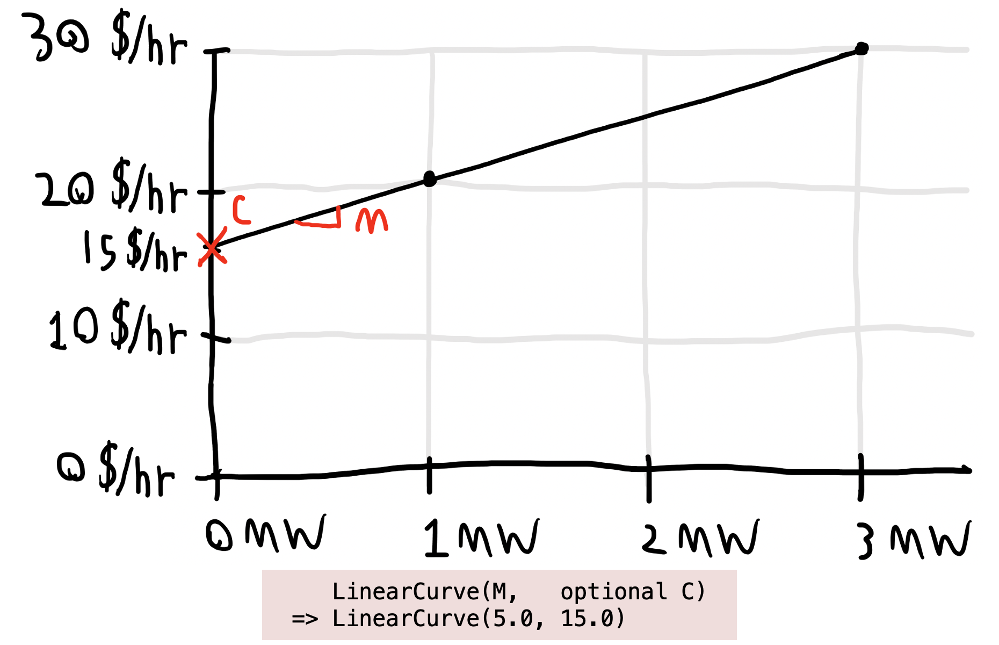
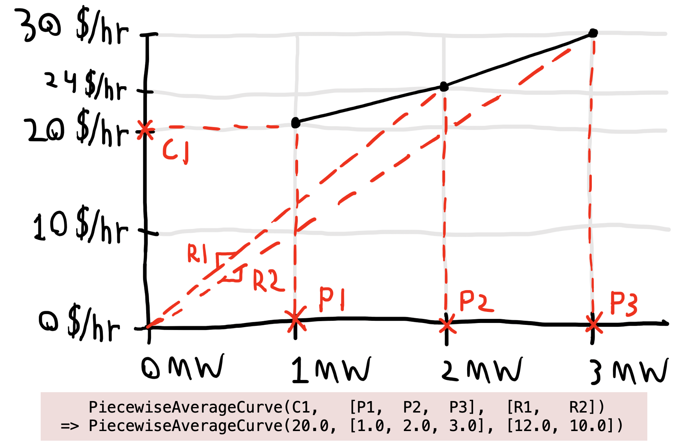

# [Variable Costs](@id curve_table)
Operating cost data typically includes both fixed and variable costs. See the how-to on [Adding an Operating Cost](@ref cost_how_to) for a demonstration of defining an operating cost.

In PowerSystems.jl, the *variable* portion of the operating cost can be represented as linear, quadratic, or piecewise input-output curves; potentially piecewise marginal heat rates; average heat rates; and more, as best fits the input data. This is done by constructing various subtypes of [`ValueCurve`](@ref).

This summary table shows each way to construct a `ValueCurve` with the user-friendly subtype aliases. The `ValueCurve`s make no assumption about units; the example interpretation given here assumes that the variable cost `ValueCurve` will be wrapped in a [`CostCurve`](@ref) with natural units. Note that all four `Piecewise` options here fundamentally represent the same curve. More information and explanatory plots are provided for each subtype alias in the subheadings below.

| Description | Example | Example interpretation |
| :--- | :--- | :--- |
| Linear input-output curve with *zero* no-load cost (constant average rate) | `LinearCurve(5.0)` | \$5/MWh |
| Linear input-output curve with potentially *nonzero* no-load cost (constant marginal rate) | `LinearCurve(5.0, 15.0)` | \$5/MWh + \$15/hr |
| Quadratic input-output curve with potentially nonzero no-load cost | `QuadraticCurve(1.0, 1.0, 18.0)` | $C(P) = 1 P^2 + 1 P + 18$ where $C$ is \$/hr, $P$ is MW |
| Piecewise linear curve specified by cost values at production points | `PiecewisePointCurve([(1.0, 20.0), (2.0, 24.0), (3.0, 30.0)])` | \$20/hr @ 1 MW, \$24/hr @ 2 MW, \$30/hr @ 3 MW, linear  \$/hr interpolation between these points |
| Piecewise linear curve specified by initial value and marginal rates (slopes) between production points | `PiecewiseIncrementalCurve(20.0, [1.0, 2.0, 3.0], [4.0, 6.0])` | \$20/hr @ 1 MW plus additional \$4/MWh from 1 MW to 2 MW plus additional \$6/MWh from 2 MW to 3 MW |
| No-load cost plus piecewise linear curve specified by initial value and marginal rates (slopes) between production points | `PiecewiseIncrementalCurve(18.0, 20.0, [1.0, 2.0, 3.0], [4.0, 6.0])` | \$18/hr no-load cost; \$20/hr @ 1 MW plus additional \$4/MWh from 1 MW to 2 MW plus additional \$6/MWh from 2 MW to 3 MW |
| Piecewise linear curve specified by initial value and average rates between production points | `PiecewiseAverageCurve(20.0, [1.0, 2.0, 3.0], [12.0, 10.0])` | \$20/hr @ 1 MW, \$12/MWh @ 2 MW, \$10/MWh @ 3 MW, linear  \$/hr interpolation between these points |

---

## [`LinearCurve`](@ref)
Specify the marginal cost of production $M$ and optionally the no-load cost $C$, which defaults to zero. Here is a graphical representation:

```@raw html

```

## [`QuadraticCurve`](@ref)
Specify the quadratic ($Q$), proportional ($M$), and constant ($C$) terms of a function that defines the input-output curve:

```@raw html

```

## [`PiecewisePointCurve`](@ref)
Specify a vector of $K$ (production, cost) pairs (i.e., $(P_k, C_k)$ for $k = 1, \dots, K$) to define the input-output curve:

```@raw html

```

## [`PiecewiseIncrementalCurve`](@ref)
Specify the cost $C_1$ at the least production point given (NOT the cost at zero production), a vector of $K$ production points $P_1, \dots, P_k$, and a vector of $K-1$ marginal rates $M_1, \dots, M_{k-1}$, that represent the slopes of the curve segments between the points. $C_1$ may be `nothing`, which results in a not-fully-defined curve. The no-load cost $C_0$ can optionally be specified as a first argument; it is not part of the representation of the curve, just another piece of data that may be stored:

```@raw html

```

## [`PiecewiseAverageCurve`](@ref)
Specify the cost $C_1$ at the least production point given (NOT the cost at zero production), a vector of $K$ production points $P_1, \dots, P_k$, and a vector of $K-1$ average rates $R_1, \dots, R_{k-1}$ at the $K-1$ latter production points:

```@raw html

```
